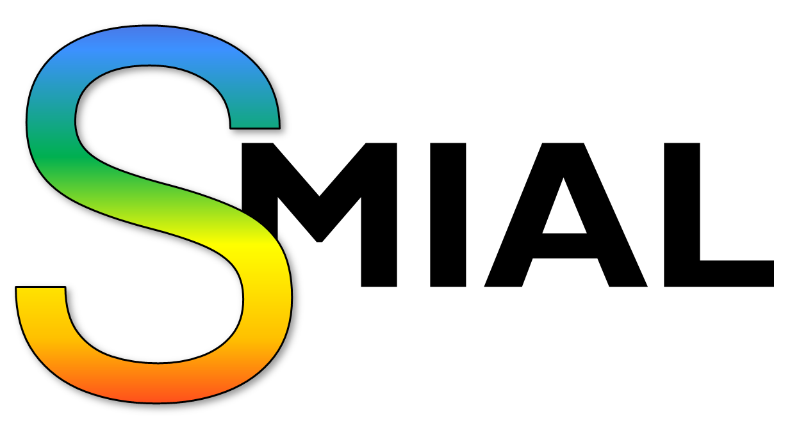
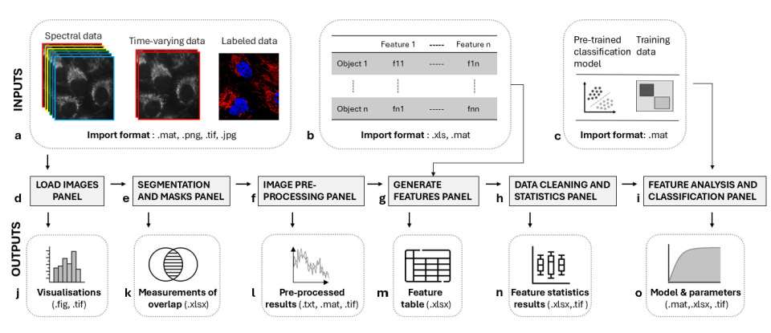

# 
Software for Multidimensional Data Analysis and Classification (SMIAL) is a user-friendly graphical user interface that enables end-to-end machine learning workflows for multidimensional imaging data without requiring programming skills.
SMIAL consists of six key panels for image and data analysis:
  1. Load Images  
  2. Segmentation and Masks  
  3. Pre-processing  
  4. Feature Generation  
  5. Data Cleaning and Statistics  
  6. Feature Analysis

## Installation Instructions
1. Download the SMIAL folder from the github repository: https://github.com/EwaGoldys/SMIAL.git
2. Install SMIAL
   - Run the MyAppInstaller_web file and follow the on-screen prompts.  
   - Select a destination folder for installation. 
   - Note if Windows displays a warning about an unknown publisher, click "More info" and then "Run anyway". This warning will not appear in future launches. 
3. Open SMIAL
   - Once installed, SMIAL software is available in the selection application folder.
   - Double-click the SMIAL icon to activate the software.
## Contributing
We welcome contributions to help improve SMIAL!
We'd like to ensure this document is always accurate and understandable. Please file an issue if any information is missing, unclear, or incorrect.
### Reporting an Issue
If you encounter a problem or have a suggestion, please raise an issue on GitHub. Issues may include:
- Errors or bugs when running SMIAL 
- Incomplete, unclear, or outdated documentation  
- Feature requests or suggestions to improve SMIAL
When raising an issue, please:
1. Include a descriptive title that summarizes your issue or suggestion  
2. In the main text, provide specific information about the issue, including:
   - What you were trying to do  
   - What happened (error messages, unexpected behavior)  
   - Steps to reproduce the issue (if applicable)  
   - Relevant screenshots or example files  
This helps us understand and address the issue more quickly.
Thank you for helping us improve SMIAL!
